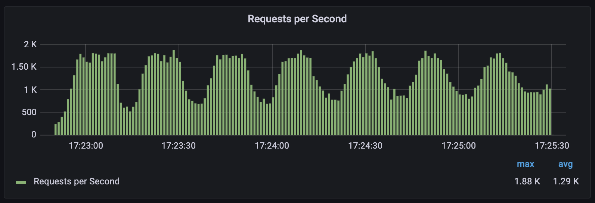
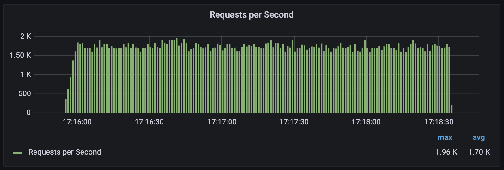
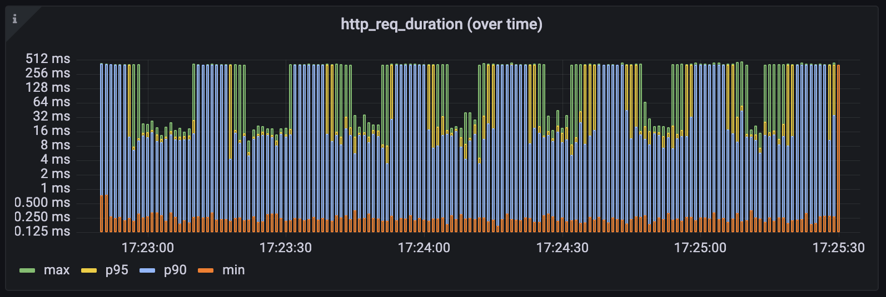
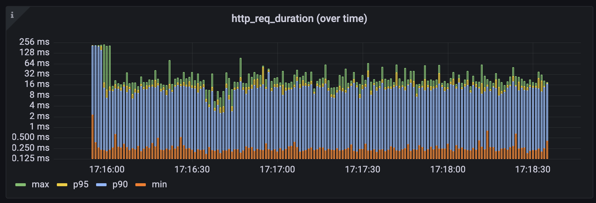
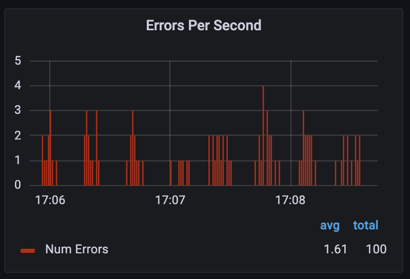
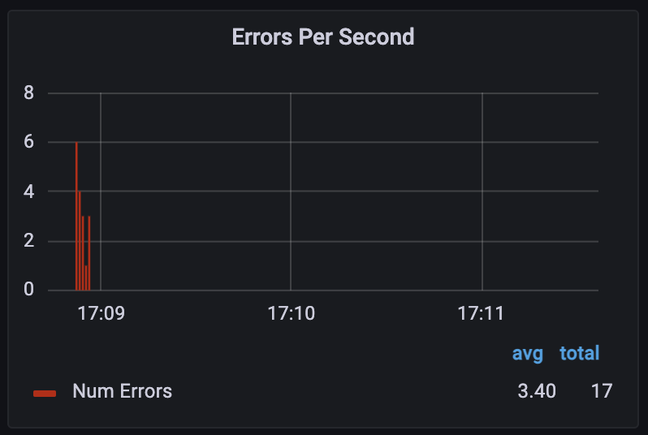

# Simple and fast NodeJS internal caching.

Forked from [node-cache](https://github.com/node-cache/node-cache) great work by [Josh Gwosdz](https://github.com/erdii), [M. Peter](https://github.com/mpneuried), [Daniel Luft](https://github.com/daluf) and [others](https://github.com/node-cache/node-cache/graphs/contributors).

A simple caching module that has `set`, `get` and `delete` methods and works a little bit like memcached.
Keys can have a timeout (`ttl`) after which they expire and are deleted from the cache.
All keys are stored in a single object so the practical limit is at around 1m keys.

We took 5.1.2 rewriten it to TypeScript and added high performance options in separate class 

## BREAKING CHANGES since node-cache

Although not breaking per definition, our typescript rewrite changed internal function.

Cache is not suporting `useClones` option set to `true` with functions as values. Use `SnowCache` to achive similar or better effect.

# Install

```bash
	npm install snow-cache --save
```

# Examples:

## Initialize (INIT):

```js
const NodeCache = require( "snow-cache" );
const myCache = new NodeCache();
```

### Options

- `stdTTL`: *(default: `0`)* the standard ttl as number in seconds for every generated cache element.
`0` = unlimited
- `checkperiod`: *(default: `600`)* The period in seconds, as a number, used for the automatic delete check interval.
`0` = no periodic check.
- `useClones`: *(default: `true`)* en/disable cloning of variables. If `true` you'll get a copy of the cached variable. If `false` you'll save and get just the reference.  
**Note:**
	- `true` is recommended if you want **simplicity**, because it'll behave like a server-based cache (it caches copies of plain data).
	- `false` is recommended if you want to achieve **performance** or save mutable objects or other complex types with mutability involved and wanted, because it'll only store references of your data.
	- _Here's a [simple code example](https://runkit.com/mpneuried/useclones-example-83) showing the different behavior_
- `deleteOnExpire`: *(default: `true`)* whether variables will be deleted automatically when they expire.
If `true` the variable will be deleted. If `false` the variable will remain. You are encouraged to handle the variable upon the event `expired` by yourself.
- `maxKeys`: *(default: `-1`)* specifies a maximum amount of keys that can be stored in the cache. If a new item is set and the cache is full, an error is thrown and the key will not be saved in the cache. -1 disables the key limit.

## NodeCache:

```ts
import NodeCache from 'snow-cache';
const stringCache = new NodeCache<string>( { stdTTL: 100, checkperiod: 120 } );
```

## SnowCache:

```ts
import { SnowCache } from 'snow-cache';
const myServiceCache = new SnowCache<{key: string}, string>( { stdTTL: 100 }, async (args: { name: string }): Promise<string> => {
    return await myServiceCall(args.name);
} );

const myResult = myServiceCache.call('key', { 'John' });
```
or if you don't like types:

```js
import { SnowCache } from 'snow-cache';
const myServiceCache = new SnowCache( { stdTTL: 100 }, async ( args ) => {
    return await myServiceCall(args);
} );

const myResult = myServiceCache.call('key', { 'John' });
```

`SnowCache` is generally quicker and more resilent to errors see result of our tests.

|NodeCache|SnowCache|
|:--:|:--:|
||
|

>Beware on the lateny graph scale is not linear

Here the test for the flaky service throwing error code 500 with probability of 1%:

|NodeCache|SnowCache|
|:--:|:--:|
||

Errors disapear in second phase of the tests as subsequent calls are repeated in case of error and the chance of error reachng to customer is very low. 

And data is refreshed in the same phase. However number of calls to the server is significantly lower. Due to the fact that SnowCashe will call the server only for cached arguments and NodeCache will call as many times as many threads ask for same inforation and no data is in the cache.

## Only in SnowCache (rest is inherited from NodeCache):
`myCache.call( key, { arg1 } )`

Cache will call a method past during construction and cache both it's result and arguments for that method under the `key`. Both arguments and result well be selialized unless `option.argsUseClones` is set to false.

Method will return the value if it is cached from the cache if it is not cached from the method past during construction. Method will be called again after `ttr` passes with first arguments for the given `key`. When after `ttr` the `call` method is used arguments will be remembered again and used in next call. 

If the method called in the backround returns an error the method will be called again if `stdTTL` is not reached. On error `refresh_error` event will be emited __remember__ to catch it and __log__ it or act upon it. 

```ts
const myResult = myServiceCache.call('key', { 'John' });
```

## Store a key (SET):

`myCache.set( key, val, [ ttl ] )`

Sets a `key` `value` pair. It is possible to define a `ttl` (in seconds).
Returns `true` on success.

*Key-validation*: The keys can be given as either `string` or `number`, but are casted to a `string` internally anyway.
All other types will throw an error.

```js
obj = { my: "Special", variable: 42 };

success = myCache.set( "myKey", obj, 10000 );
// true
```

> Note: If the key expires based on it's `ttl` it will be deleted entirely from the internal data object.

## Store multiple keys (MSET):

`myCache.mset(Array<{key, val, ttl?}>)`

Sets multiple `key` `val` pairs. It is possible to define a `ttl` (seconds).
Returns `true` on success.

```js
const obj = { my: "Special", variable: 42 };
const obj2 = { my: "other special", variable: 1337 };

const success = myCache.mset([
	{key: "myKey", val: obj, ttl: 10000},
	{key: "myKey2", val: obj2},
])
```

## Retrieve a key (GET):

`myCache.get( key )`

Gets a saved value from the cache.
Returns a `undefined` if not found or expired.
If the value was found it returns the `value`.

```js
value = myCache.get( "myKey" );
if ( value == undefined ){
	// handle miss!
}
// { my: "Special", variable: 42 }
```

**Since `2.0.0`**:

The return format changed to a simple value and a `ENOTFOUND` error if not found *( as result instance of `Error` )

**Since `2.1.0`**:

The return format changed to a simple value, but a due to discussion in #11 a miss shouldn't return an error.
So after 2.1.0 a miss returns `undefined`.

## Take a key (TAKE):

`myCache.take( key )`

get the cached value and remove the key from the cache.  
Equivalent to calling `get(key)` + `del(key)`.  
Useful for implementing `single use` mechanism such as OTP, where once a value is read it will become obsolete.

```js
myCache.set( "myKey", "myValue" )
myCache.has( "myKey" ) // returns true because the key is cached right now
value = myCache.take( "myKey" ) // value === "myValue"; this also deletes the key
myCache.has( "myKey" ) // returns false because the key has been deleted
```

## Get multiple keys (MGET):

`myCache.mget( [ key1, key2, ..., keyn ] )`

Gets multiple saved values from the cache.
Returns an empty object `{}` if not found or expired.
If the value was found it returns an object with the `key` `value` pair.

```js
value = myCache.mget( [ "myKeyA", "myKeyB" ] );
/*
	{
		"myKeyA": { my: "Special", variable: 123 },
		"myKeyB": { the: "Glory", answer: 42 }
	}
*/
```

**Since `2.0.0`**:

The method for mget changed from `.get( [ "a", "b" ] )` to `.mget( [ "a", "b" ] )`

## Delete a key (DEL):

`myCache.del( key )`

Delete a key. Returns the number of deleted entries. A delete will never fail.

```js
value = myCache.del( "A" );
// 1
```

## Delete multiple keys (MDEL):

`myCache.del( [ key1, key2, ..., keyn ] )`

Delete multiple keys. Returns the number of deleted entries. A delete will never fail.

```js
value = myCache.del( "A" );
// 1

value = myCache.del( [ "B", "C" ] );
// 2

value = myCache.del( [ "A", "B", "C", "D" ] );
// 1 - because A, B and C not exists
```

## Change TTL (TTL):

`myCache.ttl( key, ttl )`

Redefine the ttl of a key. Returns true if the key has been found and changed. Otherwise returns false.
If the ttl-argument isn't passed the default-TTL will be used.

The key will be deleted when passing in a `ttl < 0`.

```js
myCache = new NodeCache( { stdTTL: 100 } )
changed = myCache.ttl( "existentKey", 100 )
// true

changed2 = myCache.ttl( "missingKey", 100 )
// false

changed3 = myCache.ttl( "existentKey" )
// true
```

## Get TTL (getTTL):

`myCache.getTtl( key )`

Receive the ttl of a key.
You will get:
- `undefined` if the key does not exist
- `0` if this key has no ttl
- a timestamp in ms representing the time at which the key will expire

```js
myCache = new NodeCache( { stdTTL: 100 } )

// Date.now() = 1456000500000
myCache.set( "ttlKey", "MyExpireData" )
myCache.set( "noTtlKey", "NonExpireData", 0 )

ts = myCache.getTtl( "ttlKey" )
// ts wil be approximately 1456000600000

ts = myCache.getTtl( "ttlKey" )
// ts wil be approximately 1456000600000

ts = myCache.getTtl( "noTtlKey" )
// ts = 0

ts = myCache.getTtl( "unknownKey" )
// ts = undefined
```

## List keys (KEYS)

`myCache.keys()`

Returns an array of all existing keys.

```js
mykeys = myCache.keys();

console.log( mykeys );
// [ "all", "my", "keys", "foo", "bar" ]
```

## Has key (HAS)

`myCache.has( key )`

Returns boolean indicating if the key is cached.

```js
exists = myCache.has( 'myKey' );

console.log( exists );
```

## Statistics (STATS):

`myCache.getStats()`

Returns the statistics.

```js
myCache.getStats();
	/*
		{
			keys: 0,    // global key count
			hits: 0,    // global hit count
			misses: 0,  // global miss count
			ksize: 0,   // global key size count in approximately bytes
			vsize: 0    // global value size count in approximately bytes
		}
	*/
```

## Flush all data (FLUSH):

`myCache.flushAll()`

Flush all data.

```js
myCache.flushAll();
myCache.getStats();
	/*
		{
			keys: 0,    // global key count
			hits: 0,    // global hit count
			misses: 0,  // global miss count
			ksize: 0,   // global key size count in approximately bytes
			vsize: 0    // global value size count in approximately bytes
		}
	*/
```

## Flush the stats (FLUSH STATS):

`myCache.flushStats()`

Flush the stats.

```js
myCache.flushStats();
myCache.getStats();
	/*
		{
			keys: 0,    // global key count
			hits: 0,    // global hit count
			misses: 0,  // global miss count
			ksize: 0,   // global key size count in approximately bytes
			vsize: 0    // global value size count in approximately bytes
		}
	*/
```

## Close the cache:

`myCache.close()`

This will clear the interval timeout which is set on check period option.

```js
myCache.close();
```

# Events

## refresh_error (SnowCache only)

On error `refresh_error` event will be emited __remember__ to catch it and __log__ it or act upon it. 

```ts
myCache.on( "set", function( error, key, args) ){
	// ... do something ...
	console.log(error); //or something similar
});
```

## set

Fired when a key has been added or changed.
You will get the `key` and the `value` as callback argument.

```js
myCache.on( "set", function( key, value ){
	// ... do something ...
});
```

## del

Fired when a key has been removed manually or due to expiry.
You will get the `key` and the deleted `value` as callback arguments.

```js
myCache.on( "del", function( key, value ){
	// ... do something ...
});
```

## expired

Fired when a key expires.
You will get the `key` and `value` as callback argument.

```js
myCache.on( "expired", function( key, value ){
	// ... do something ...
});
```

## flush

Fired when the cache has been flushed.

```js
myCache.on( "flush", function(){
	// ... do something ...
});
```

## flush_stats

Fired when the cache stats has been flushed.

```js
myCache.on( "flush_stats", function(){
	// ... do something ...
});
```
## Re-run the performance tests

In separate terminals run:

`npm run compile-watch` this will watch for your changes

`cd test; docker-compose up` this will start `grafana` and `influxdb`

`npm run mock-server-watch` this will watch for your changes

```bash
cd ./test/
docker-compose run k6 run /scripts/load.k6.js
```
The catalogue is from docker.

Now click this link http://localhost:3000/dashboards select prefered dashboard and enjoy the show `refresh` is an icon in right upper conrner . You can change scerios to ones commented out in the `./test/load.k6.js`.

## Compatibility

snow-cache supports all node versions >= 8 (check!!!)

## Release History

|Version|Date|Description|
|:--:|:--:|:--|
|1.0.0|2024-03-01|Fork from `node_cache` TS rewrite and `SnowCache` added.|


## Other projects

|Name|Description|
|:--|:--|
|[**node-cache**](https://github.com/smrchy/rsmq)|Project that we are a humble clone of|
|[**rsmq**](https://github.com/smrchy/rsmq)|A really simple message queue based on redis|
|[**redis-heartbeat**](https://github.com/mpneuried/redis-heartbeat)|Pulse a heartbeat to redis. This can be used to detach or attach servers to nginx or similar problems.|
|[**systemhealth**](https://github.com/mpneuried/systemhealth)|Node module to run simple custom checks for your machine or it's connections. It will use [redis-heartbeat](https://github.com/mpneuried/redis-heartbeat) to send the current state to redis.|
|[**rsmq-cli**](https://github.com/mpneuried/rsmq-cli)|a terminal client for rsmq|
|[**rest-rsmq**](https://github.com/smrchy/rest-rsmq)|REST interface for.|
|[**redis-sessions**](https://github.com/smrchy/redis-sessions)|An advanced session store for NodeJS and Redis|
|[**connect-redis-sessions**](https://github.com/mpneuried/connect-redis-sessions)|A connect or express middleware to simply use the [redis sessions](https://github.com/smrchy/redis-sessions). With [redis sessions](https://github.com/smrchy/redis-sessions) you can handle multiple sessions per user_id.|
|[**redis-notifications**](https://github.com/mpneuried/redis-notifications)|A redis based notification engine. It implements the rsmq-worker to safely create notifications and recurring reports.|
|[**nsq-logger**](https://github.com/mpneuried/nsq-logger)|Nsq service to read messages from all topics listed within a list of nsqlookupd services.|
|[**nsq-topics**](https://github.com/mpneuried/nsq-topics)|Nsq helper to poll a nsqlookupd service for all it's topics and mirror it locally.|
|[**nsq-nodes**](https://github.com/mpneuried/nsq-nodes)|Nsq helper to poll a nsqlookupd service for all it's nodes and mirror it locally.|
|[**nsq-watch**](https://github.com/mpneuried/nsq-watch)|Watch one or many topics for unprocessed messages.|
|[**hyperrequest**](https://github.com/mpneuried/hyperrequest)|A wrapper around [hyperquest](https://github.com/substack/hyperquest) to handle the results|
|[**task-queue-worker**](https://github.com/smrchy/task-queue-worker)|A powerful tool for background processing of tasks that are run by making standard http requests
|[**soyer**](https://github.com/mpneuried/soyer)|Soyer is small lib for server side use of Google Closure Templates with node.js.|
|[**grunt-soy-compile**](https://github.com/mpneuried/grunt-soy-compile)|Compile Goggle Closure Templates ( SOY ) templates including the handling of XLIFF language files.|
|[**backlunr**](https://github.com/mpneuried/backlunr)|A solution to bring Backbone Collections together with the browser fulltext search engine Lunr.js|
|[**domel**](https://github.com/mpneuried/domel)|A simple dom helper if you want to get rid of jQuery|
|[**obj-schema**](https://github.com/mpneuried/obj-schema)|Simple module to validate an object by a predefined schema|

# The MIT License (MIT)

Copyright © 2019 Mathias Peter and the snow-cache maintainers, https://github.com/snow-cache/snow-cache

Permission is hereby granted, free of charge, to any person obtaining
a copy of this software and associated documentation files (the
'Software'), to deal in the Software without restriction, including
without limitation the rights to use, copy, modify, merge, publish,
distribute, sublicense, and/or sell copies of the Software, and to
permit persons to whom the Software is furnished to do so, subject to
the following conditions:

The above copyright notice and this permission notice shall be
included in all copies or substantial portions of the Software.

THE SOFTWARE IS PROVIDED 'AS IS', WITHOUT WARRANTY OF ANY KIND,
EXPRESS OR IMPLIED, INCLUDING BUT NOT LIMITED TO THE WARRANTIES OF
MERCHANTABILITY, FITNESS FOR A PARTICULAR PURPOSE AND NONINFRINGEMENT.
IN NO EVENT SHALL THE AUTHORS OR COPYRIGHT HOLDERS BE LIABLE FOR ANY
CLAIM, DAMAGES OR OTHER LIABILITY, WHETHER IN AN ACTION OF CONTRACT,
TORT OR OTHERWISE, ARISING FROM, OUT OF OR IN CONNECTION WITH THE
SOFTWARE OR THE USE OR OTHER DEALINGS IN THE SOFTWARE.
